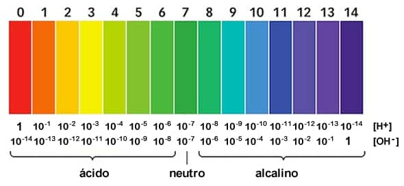

<!DOCTYPE html>
<html lang="es">
<head>
    <meta charset="UTF-8">
    <meta name="viewport" content="width=device-width, initial-scale=1.0">
    <meta name="description" content="Página informativa sobre el pH en química y su importancia en proyectos con Arduino.">
    <title>Información sobre el pH</title>
    <link rel="stylesheet" href="styles.css">
</head>
<body>
    <header>
        <h1>Información sobre el pH</h1>
        <nav>
            <ul>
                <li><a href="#introduccion">Introducción</a></li>
                <li><a href="#definicion">Definición</a></li>
                <li><a href="#escala">Escala de pH</a></li>
                <li><a href="#medicion">Medición del pH</a></li>
                <li><a href="#importancia">Importancia del pH</a></li>
                <li><a href="#buffers">Soluciones Buffer</a></li>
                <li><a href="#factores">Factores que Afectan el pH</a></li>
                <li><a href="#conclusion">Conclusión</a></li>
                <li><a href="#bibliografia">Bibliografía</a></li>
            </ul>
        </nav>
    </header>

    <main>
        <section id="introduccion">
            <h2>1. Introducción al pH</h2>
            
El pH es una de las medidas más importantes en química y biología, ya que proporciona información crítica sobre la acidez o basicidad de una solución. Su importancia se extiende a múltiples disciplinas, incluyendo la medicina, la agricultura, la biotecnología y la ecología.

        </section>

        <section id="definicion">
            <h2>2. Definición del pH</h2>
            
El pH se define como el logaritmo negativo de la concentración de iones hidrógeno [H+] en una solución:

            
pH = -log[H+]

            
Esto significa que una pequeña variación en la concentración de [H+] puede resultar en un cambio significativo en el valor de pH.

        </section>

        <section id="escala">
            <h2>3. Escala de pH</h2>
            
La escala de pH va de 0 a 14:

            <ul class="text-center">
                <li><strong>pH &lt; 7:</strong> Indica que la solución es ácida.</li>
                <li><strong>pH = 7:</strong> Considerada una solución neutra, como el agua pura.</li>
                <li><strong>pH &gt; 7:</strong> Indica que la solución es básica o alcalina.</li>
            </ul>
            
            
Ejemplos de pH de sustancias comunes incluyen ácido clorhídrico (pH ≈ 1) y amoníaco (pH ≈ 11).

        </section>

        <section id="medicion">
            <h2>4. Cómo se mide el pH</h2>
            
El pH se puede medir mediante diferentes métodos:

            <ul class="text-center">
                <li><strong>Papeles indicadores:</strong> Cambian de color dependiendo del pH de la solución.</li>
                <li><strong>pH-metros:</strong> Proporcionan mediciones precisas mediante un electrodo.</li>
                <li><strong>Métodos visuales:</strong> Usan reactivos que cambian de color en función del pH.</li>
            </ul>
        </section>

        <section id="importancia">
            <h2>5. Importancia del pH</h2>
            
El pH es fundamental en diversas aplicaciones y áreas de estudio:

            <ul class="text-center">
                <li><strong>Química:</strong> Afecta la velocidad y equilibrio de reacciones químicas.</li>
                <li><strong>Biología:</strong> Influye en el metabolismo y la salud de los organismos.</li>
                <li><strong>Medicina:</strong> Su diagnóstico puede indicar condiciones de salud.</li>
                <li><strong>Agricultura:</strong> El pH del suelo afecta el crecimiento de las plantas.</li>
            </ul>
        </section>

        <section id="buffers">
            <h2>6. Soluciones Buffer</h2>
            
Las soluciones buffer son mezclas que resisten cambios en el pH al agregar ácidos o bases.

            
Ejemplo: El ácido acético y el acetato de sodio forman un buffer que mantiene un pH cercano a 4.75.

            
        </section>

        <section id="factores">
            <h2>7. Factores que Afectan el pH</h2>
            
El pH puede ser influenciado por varios factores:

            <ul class="text-center">
                <li><strong>Concentración de iones hidrógeno:</strong> La adición de ácidos o bases alterará la concentración de [H+].</li>
                <li><strong>Temperatura:</strong> Puede afectar la ionización del agua, modificando el pH.</li>
                <li><strong>Presión:</strong> En soluciones gaseosas, la presión puede afectar la disolución de gases y su interacción con el agua.</li>
            </ul>
        </section>

        <section id="conclusion">
            <h2>8. Conclusión</h2>
            
El pH es una propiedad fundamental en química y biología que influye en una variedad de procesos y aplicaciones. Desde la regulación de reacciones químicas hasta el mantenimiento de la salud en organismos vivos, el pH es crucial para entender el comportamiento de sustancias y sistemas.

        </section>

        <section id="bibliografia">
            <h2>9. Bibliografía</h2>
            <ul class="text-center">
                <li>Atkins, P. W., & de Paula, J. (2014). <em>Physical Chemistry</em>. Oxford University Press.</li>
                <li>Hill, G. A., & Ralston, J. (2005). <em>Biochemistry for Dummies</em>. Wiley Publishing, Inc.</li>
                <li>Bessinger, D. R. (2000). <em>pH Measurement in Biological Systems</em>. Springer.</li>
                <li>Nelson, D. L., & Cox, M. M. (2017). <em>Lehninger Principles of Biochemistry</em>. W.H. Freeman and Company.</li>
                <li>American Chemical Society. (2015). <em>Acids and Bases</em>.</li>
            </ul>
        </section>
    </main>

    <footer>
        
&copy; 2024 Información sobre el pH. Todos los derechos reservados.

    </footer>

    
</body>
</html>
